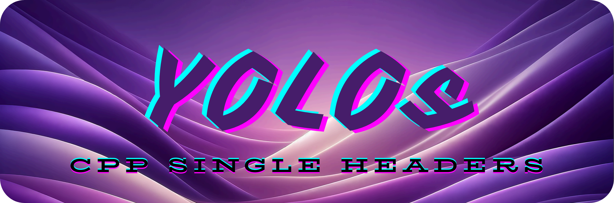

<p align="center">
  
</p>

<h1 align="center">YOLOs-CPP</h1>
<h3 align="center">Production-Ready YOLO Inference Engine for C++</h3>

<p align="center">
  <em>A blazing-fast, unified C++ inference library for the entire YOLO family</em>
</p>

<p align="center">
  <a href="https://github.com/Geekgineer/YOLOs-CPP/stargazers"></a>
  <a href="https://github.com/Geekgineer/YOLOs-CPP/network/members"></a>
  <a href="https://github.com/Geekgineer/YOLOs-CPP/releases"></a>
  <a href="https://github.com/Geekgineer/YOLOs-CPP/blob/main/LICENSE"></a>
  <a href="https://github.com/Geekgineer/YOLOs-CPP/actions"></a>
</p>

<p align="center">
  <a href="#-quick-start">Quick Start</a> · 
  <a href="#-features">Features</a> · 
  <a href="#-supported-models">Models</a> · 
  <a href="#-api-reference">API</a> · 
  <a href="#-benchmarks">Benchmarks</a> · 
  <a href="doc/installation.md">Docs</a>
</p>

---

## 📰 Latest News

* **[2026.01.22]** ROS 2 integration released. [ros2_yolos_cpp](https://github.com/Geekgineer/ros2_yolos_cpp)
* **[2026.01.18]** Production-ready v1.0.0 released. [Watch video](https://www.youtube.com/watch?v=Ax5vaYJ-mVQ)
* **[2025.05.15]** Classification support added.
* **[2025.04.04]** [Depths-CPP](https://github.com/Geekgineer/Depths-CPP) - New project for real-time metric depth estimation.
* **[2025.03.16]** Pose estimation support added.
* **[2025.02.19]** YOLOv12 support for object detection.
* **[2025.02.11]** Oriented bounding box (OBB) format support added.
* **[2025.01.29]** YOLOv9 support for object detection.
* **[2025.01.26]** Segmentation support for YOLOv9.
* **[2025.01.26]** Segmentation support for YOLOv8 and YOLOv11 with quantized models.
* **[2024.10.23]** Initial release v0.0.1 with object detection support.

---

## Why YOLOs-CPP?

**YOLOs-CPP** is a production-grade inference engine that brings the entire YOLO ecosystem to C++. Unlike scattered implementations, YOLOs-CPP provides a **unified, consistent API** across all YOLO versions and tasks.

```cpp
#include "yolos/yolos.hpp"

// One API for all YOLO versions and tasks
auto detector = yolos::det::YOLODetector("yolo11n.onnx", "coco.names");
auto detections = detector.detect(frame);
```

### The Problem

- **Fragmented ecosystem**: Each YOLO version has different C++ implementations
- **Inconsistent APIs**: Different interfaces for detection, segmentation, pose
- **Production gaps**: Most implementations lack proper error handling, testing, and optimization

### The Solution

YOLOs-CPP unifies everything under one roof:

| What You Get | Description |
|--------------|-------------|
| **Unified API** | Same interface for YOLOv5 through YOLO26 |
| **All Tasks** | Detection, Segmentation, Pose, OBB, Classification |
| **Battle-Tested** | 36 automated tests, CI/CD pipeline |
| **Optimized** | Zero-copy preprocessing, batched NMS, GPU acceleration |
| **Cross-Platform** | Linux, Windows, macOS, Docker |

---

## 🎬 Demo

<table>
  <tr>
    <td align="center" width="50%">
      
      <br/><strong>Instance Segmentation</strong>
    </td>
    <td align="center" width="50%">
      
      <br/><strong>Pose Estimation</strong>
    </td>
  </tr>
  <tr>
    <td align="center" width="50%">
      
      <br/><strong>Real-time Detection</strong>
    </td>
    <td align="center" width="50%">
      
      <br/><strong>Multi-Object Detection</strong>
    </td>
  </tr>
</table>

---

## ⚡ Quick Start

### Prerequisites

| Requirement | Version | Notes |
|-------------|---------|-------|
| C++ Compiler | C++17 | GCC 9+, Clang 10+, MSVC 2019+ |
| CMake | ≥ 3.16 | |
| OpenCV | ≥ 4.5 | Core, ImgProc, HighGUI |
| ONNX Runtime | ≥ 1.16 | Auto-downloaded by build script |

### Installation

```bash
# Clone
git clone https://github.com/Geekgineer/YOLOs-CPP.git
cd YOLOs-CPP

# Build (auto-downloads ONNX Runtime)
./build.sh 1.20.1 0   # CPU build
./build.sh 1.20.1 1   # GPU build (requires CUDA)

# Run
./build/image_inference models/yolo11n.onnx data/dog.jpg
```

<details>
<summary><strong>📦 Manual CMake Build</strong></summary>

```bash
# Download ONNX Runtime
wget https://github.com/microsoft/onnxruntime/releases/download/v1.20.1/onnxruntime-linux-x64-1.20.1.tgz
tar -xzf onnxruntime-linux-x64-1.20.1.tgz

# Configure and build
mkdir build && cd build
cmake .. -DONNXRUNTIME_DIR=../onnxruntime-linux-x64-1.20.1 -DCMAKE_BUILD_TYPE=Release
make -j$(nproc)
```

</details>

<details>
<summary><strong>🐳 Docker</strong></summary>

```bash
# CPU
docker build -f Dockerfile.cpu -t yolos-cpp:cpu .
docker run --rm -it yolos-cpp:cpu

# GPU (requires nvidia-docker)
docker build -t yolos-cpp:gpu .
docker run --gpus all --rm -it yolos-cpp:gpu
```

</details>

---

## 🎯 Features

### Supported Models

| Version | Detection | Segmentation | Pose | OBB | Classification |
|---------|:---------:|:------------:|:----:|:---:|:--------------:|
| YOLOv5  | ✅ | — | — | — | — |
| YOLOv6  | ✅ | — | — | — | — |
| YOLOv7  | ✅ | — | — | — | — |
| YOLOv8  | ✅ | ✅ | ✅ | ✅ | ✅ |
| YOLOv9  | ✅ | — | — | — | — |
| YOLOv10 | ✅ | — | — | — | — |
| YOLOv11 | ✅ | ✅ | ✅ | ✅ | ✅ |
| YOLOv12 | ✅ | — | — | — | — |
| **YOLO26** | ✅ | ✅ | ✅ | ✅ | ✅ |

### Core Capabilities

- **🚀 High Performance**: Zero-copy preprocessing, optimized NMS, GPU acceleration
- **🎯 Precision Matched**: Identical results to Ultralytics Python (validated by 36 automated tests)
- **📦 Self-Contained**: No Python runtime, no external dependencies at runtime
- **🔌 Easy Integration**: Header-based library, modern C++17 API
- **⚙️ Flexible**: CPU/GPU, dynamic/static input shapes, configurable thresholds

---

## 📖 API Reference

### Object Detection

```cpp
#include "yolos/yolos.hpp"

// Initialize
yolos::det::YOLODetector detector("model.onnx", "coco.names", /*gpu=*/true);

// Detect
cv::Mat frame = cv::imread("image.jpg");
auto detections = detector.detect(frame, /*conf=*/0.25f, /*iou=*/0.45f);

// Process results
for (const auto& det : detections) {
    std::cout << "Class: " << det.className 
              << " Conf: " << det.confidence 
              << " Box: " << det.box << std::endl;
}

// Visualize
detector.drawDetections(frame, detections);
```

### Instance Segmentation

```cpp
yolos::seg::YOLOSegDetector detector("yolo11n-seg.onnx", "coco.names", true);
auto segments = detector.segment(frame);
detector.drawSegmentations(frame, segments, /*maskAlpha=*/0.5f);
```

### Pose Estimation

```cpp
yolos::pose::YOLOPoseDetector detector("yolo11n-pose.onnx", "", true);
auto poses = detector.detect(frame);
detector.drawPoses(frame, poses);
```

### Oriented Bounding Boxes (OBB)

```cpp
yolos::obb::YOLOOBBDetector detector("yolo11n-obb.onnx", "dota.names", true);
auto boxes = detector.detect(frame);
detector.drawOBBs(frame, boxes);
```

### Image Classification

```cpp
yolos::cls::YOLOClassifier classifier("yolo11n-cls.onnx", "imagenet.names", true);
auto result = classifier.classify(frame);
std::cout << "Predicted: " << result.className << " (" << result.confidence * 100 << "%)" << std::endl;
```

---

## 📊 Benchmarks

Tested on Intel i7-12700H (CPU) / NVIDIA RTX 3060 (GPU), 640×640 input:

| Model | Task | Device | FPS | Latency | Memory |
|-------|------|--------|----:|--------:|-------:|
| YOLOv11n | Detection | CPU | 15 | 67ms | 48MB |
| YOLOv11n | Detection | GPU | 97 | 10ms | 412MB |
| YOLOv8n | Detection | GPU | 86 | 12ms | 398MB |
| YOLO26n | Detection | GPU | 78 | 13ms | 425MB |
| YOLOv11n-seg | Segmentation | GPU | 65 | 15ms | 524MB |
| YOLOv11n-pose | Pose | GPU | 80 | 12ms | 445MB |

<details>
<summary><strong>Run Your Own Benchmarks</strong></summary>

```bash
cd benchmarks
./auto_bench.sh 1.20.1 0 yolo11n,yolov8n,yolo26n
```

Results are saved to `benchmarks/results/`.

</details>

---

## 🏗️ Architecture

```
YOLOs-CPP/
├── include/yolos/           # Core library
│   ├── core/                # Shared utilities
│   │   ├── types.hpp        # Detection, Segmentation result types
│   │   ├── preprocessing.hpp # Letterbox, normalization
│   │   ├── nms.hpp          # Non-maximum suppression
│   │   ├── drawing.hpp      # Visualization utilities
│   │   └── version.hpp      # YOLO version detection
│   ├── tasks/               # Task implementations
│   │   ├── detection.hpp    # Object detection
│   │   ├── segmentation.hpp # Instance segmentation
│   │   ├── pose.hpp         # Pose estimation
│   │   ├── obb.hpp          # Oriented bounding boxes
│   │   └── classification.hpp
│   └── yolos.hpp            # Main include (includes all)
├── src/                     # Example applications
├── examples/                # Task-specific examples
├── tests/                   # Automated test suite
├── benchmarks/              # Performance benchmarking
└── models/                  # Sample models & labels
```

---

## 📚 Documentation

| Guide | Description |
|-------|-------------|
| [Installation](doc/installation.md) | System requirements, build options, troubleshooting |
| [Usage Guide](doc/usage.md) | API reference, code examples, best practices |
| [Model Guide](doc/models.md) | Supported models, ONNX export, quantization |
| [Development](doc/development.md) | Architecture, extending the library, debugging |
| [Contributing](doc/contributing.md) | Code style, PR process, testing |
| [Windows Setup](doc/YOLOs-CPP_on_Windows_11.md) | Windows-specific build instructions |

---

## 🧪 Testing

YOLOs-CPP includes a comprehensive test suite that validates C++ inference against Ultralytics Python:

```bash
cd tests
./test_all.sh    # Run all tests
./test_detection.sh  # Run detection tests only
```

| Task | Tests | Status |
|------|------:|:------:|
| Detection | 8 | ✅ |
| Segmentation | 8 | ✅ |
| Pose | 7 | ✅ |
| OBB | 7 | ✅ |
| Classification | 6 | ✅ |
| **Total** | **36** | ✅ |

---

## 🤝 Contributing

We welcome contributions! See our [Contributing Guide](doc/contributing.md) for details.

```bash
# Fork, clone, branch
git checkout -b feature/amazing-feature

# Make changes, test
./tests/test_all.sh

# Commit and PR
git commit -m "feat: add amazing feature"
git push origin feature/amazing-feature
```

---

## 📄 License

This project is licensed under the **GNU Affero General Public License v3.0 (AGPL-3.0)**. See [LICENSE](LICENSE) for details.

For commercial licensing options, please contact the maintainers.

---

## 🙏 Acknowledgments

YOLOs-CPP builds on the shoulders of giants:

- [Ultralytics](https://github.com/ultralytics/ultralytics) — YOLO models and training
- [ONNX Runtime](https://github.com/microsoft/onnxruntime) — High-performance inference
- [OpenCV](https://github.com/opencv/opencv) — Computer vision primitives

---

<p align="center">
  <strong>⭐ If YOLOs-CPP helps your project, consider giving it a star!</strong>
</p>

<p align="center">
  Made with ❤️ by the <a href="https://github.com/Geekgineer/YOLOs-CPP/graphs/contributors">YOLOs-CPP Team</a>
</p>
